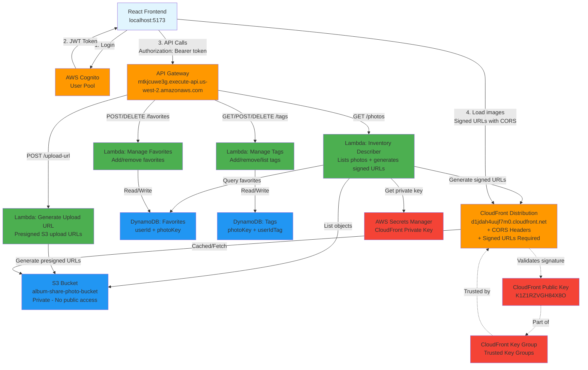
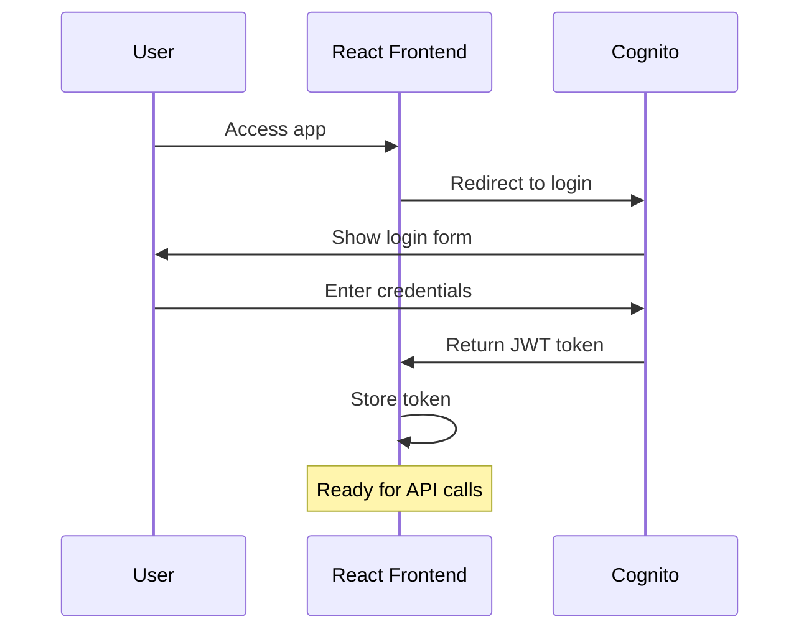
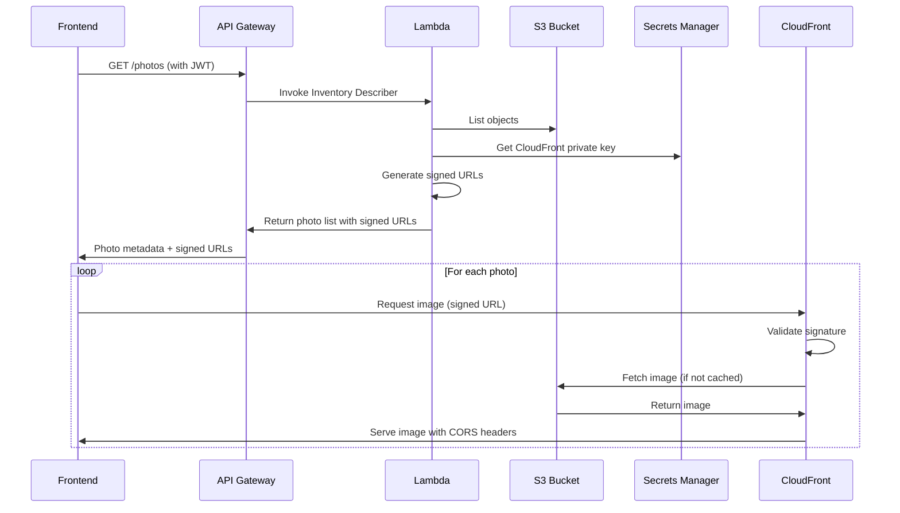
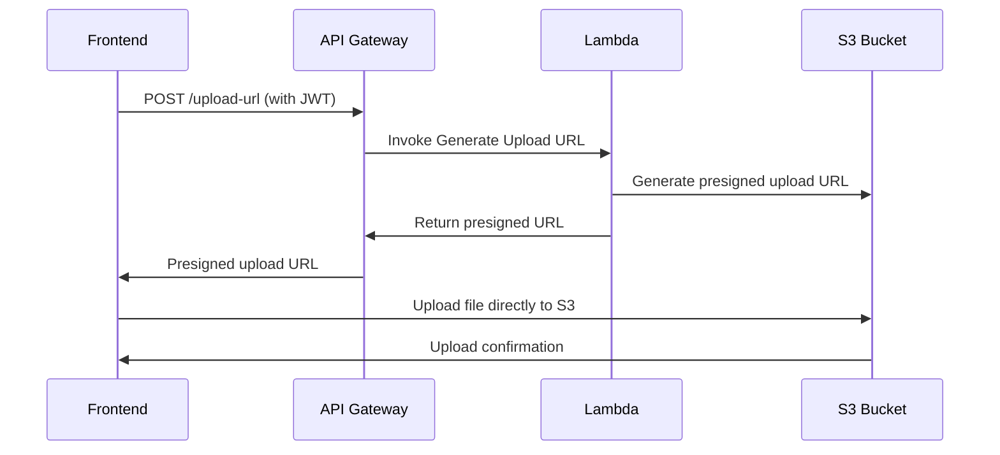
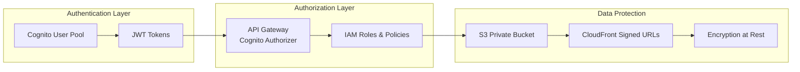
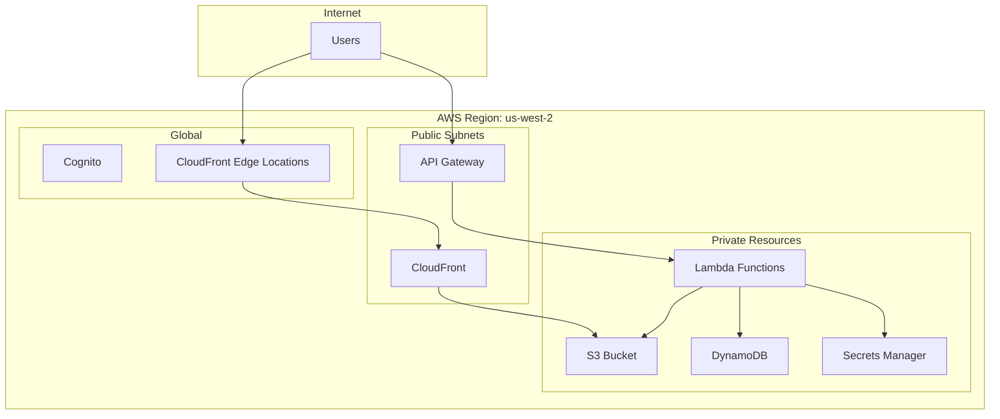

# ShareAlbum System Architecture

## High-Level Architecture Diagram

## Data Flow Diagrams

### 1. User Authentication Flow

### 2. Photo Loading Flow

### 3. Photo Upload Flow

## Component Details

### AWS Resources Created

| Component | Resource Name | Purpose |
|-----------|---------------|---------|
| **S3 Bucket** | `album-share-photo-bucket-129045776282-us-west-2` | Private photo storage |
| **CloudFront** | `d1jdah4uujf7m0.cloudfront.net` | CDN with signed URLs + CORS |
| **API Gateway** | `mtkjcuwe3g.execute-api.us-west-2.amazonaws.com` | REST API endpoints |
| **Cognito User Pool** | `us-west-2_wWKJ8mrfJ` | User authentication |
| **DynamoDB Tables** | `FavoritesTable`, `TagsTable` | User data storage |
| **Lambda Functions** | 4 functions for different operations | Business logic |
| **Secrets Manager** | CloudFront private key storage | Secure key management |

### Security Model

### Cost Optimization Features

1. **CloudFront Caching**: 24-hour cache reduces S3 requests
2. **DynamoDB On-Demand**: Pay per request, no provisioned capacity
3. **Lambda**: Pay per execution, automatic scaling
4. **S3 Intelligent Tiering**: Automatic cost optimization for storage

### Performance Features

1. **CloudFront Edge Locations**: Global CDN for fast image delivery
2. **Lambda Caching**: Private key cached in memory
3. **Signed URL Expiration**: 1-hour expiration reduces key retrieval
4. **Optimized Cache Policies**: Separate policies for API vs images

## Network Architecture

## Monitoring & Observability

- **CloudWatch Logs**: Lambda function logs
- **CloudWatch Metrics**: API Gateway, Lambda, CloudFront metrics
- **X-Ray Tracing**: Distributed tracing (can be enabled)
- **CloudFront Analytics**: Cache hit rates, geographic distribution

---

*This diagram represents the current state of your ShareAlbum system as deployed.*